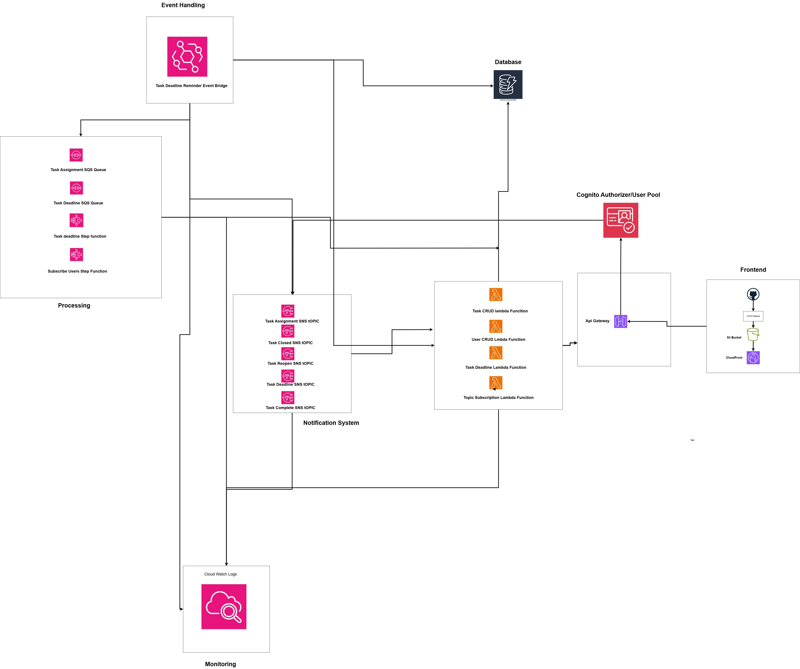

# Task Manager API

A serverless task management system built with AWS services that allows users to create, assign, track, and manage tasks efficiently.

## Overview

The Task Manager API is a comprehensive serverless application that provides a complete solution for task management within organizations. It leverages various AWS services to deliver a scalable, reliable, and cost-effective solution.

## Architecture

The application follows a serverless architecture pattern using AWS services:



### Key Components:

- **API Gateway**: Provides RESTful API endpoints for client applications
- **Lambda Functions**: Handle business logic for various operations
- **DynamoDB**: Stores task and user data
- **Cognito**: Manages user authentication and authorization
- **SNS**: Handles notifications for task assignments and deadlines
- **SQS**: Manages asynchronous processing of tasks
- **Step Functions**: Orchestrates complex workflows like user onboarding and task deadline processing

## Features

- **User Management**
  - User registration and authentication via Cognito
  - Role-based access control (Admin and User roles)
  - User profile management

- **Task Management**
  - Create, read, update, and delete tasks
  - Assign tasks to users
  - Track task status (Open, In Progress, Completed, Closed)
  - Set and monitor task deadlines
  - Reassign tasks to different users
  - Reopen closed tasks

- **Notifications**
  - Task assignment notifications
  - Deadline approaching notifications
  - Task status change notifications
  - Task completion notifications

- **Workflow Automation**
  - Automatic user onboarding process
  - Deadline monitoring and expiration handling
  - Task status transitions

## Technologies Used

- **Backend**:
  - Java 17
  - AWS Lambda
  - Amazon API Gateway
  - Amazon DynamoDB
  - Amazon Cognito
  - Amazon SNS
  - Amazon SQS
  - AWS Step Functions
  - AWS SAM (Serverless Application Model)

- **Development Tools**:
  - Maven
  - JUnit for testing
  - AWS SDK for Java
  - GitHub for version control

## API Endpoints

### Authentication
- `POST /login` - User login
- `POST /users` - Create a new user (Admin only)
- `GET /users` - Get all users (Admin only)

### Task Management
- `POST /tasks` - Create a new task (Admin only)
- `GET /tasks` - Get all tasks
- `GET /tasks/user/{userId}` - Get tasks assigned to a specific user
- `PUT /tasks/status` - Update task status
- `PUT /tasks/reassign` - Reassign a task to a different user
- `POST /tasks/reopen` - Reopen a closed task
- `DELETE /tasks/{taskId}` - Delete a task (Admin only)

## Setup and Deployment

### Prerequisites
- AWS Account
- AWS CLI installed and configured
- AWS SAM CLI - [Install the SAM CLI](https://docs.aws.amazon.com/serverless-application-model/latest/developerguide/serverless-sam-cli-install.html)
- Java 17
- Maven - [Install Maven](https://maven.apache.org/install.html)
- Docker - [Install Docker community edition](https://hub.docker.com/search/?type=edition&offering=community)

### Deployment Steps

1. Clone the repository:
   ```
   git clone <repository-url>
   cd task-manager-api
   ```

2. Build the application:
   ```
   mvn clean package
   ```

3. Deploy using SAM:
   ```
   sam build
   sam deploy --guided
   ```

4. During the guided deployment, you'll be prompted for:
   - **Stack Name**: The name of the stack to deploy to CloudFormation (e.g., task-manager-api)
   - **AWS Region**: The AWS region you want to deploy your app to
   - **Stage**: The deployment stage (dev or prod)
   - **Confirm changes before deploy**: Whether to review changes before deployment
   - **Allow SAM CLI IAM role creation**: Required for creating necessary IAM roles
   - **Save arguments to samconfig.toml**: Save settings for future deployments

5. After deployment, note the API Gateway endpoint URL and Cognito details from the outputs.

## Local Development and Testing

### Build the Application

Build your application with the `sam build` command:

```bash
sam build
```

The SAM CLI installs dependencies defined in `TaskManagerApi/pom.xml`, creates a deployment package, and saves it in the `.aws-sam/build` folder.

### Test Individual Functions

Test a single function by invoking it directly with a test event:

```bash
# Example: Test the login function
sam local invoke LoginUserHandlerFunction --event events/event.json
```

### Run the API Locally

The SAM CLI can emulate your application's API. Use the `sam local start-api` command to run the API locally on port 3000:

```bash
sam local start-api
```

You can then test the API endpoints using tools like curl or Postman:

```bash
# Example: Login a user
curl -X POST http://localhost:3000/login -H "Content-Type: application/json" -d '{"email":"user@example.com","password":"password123"}'

# Example: Get all tasks (requires authentication)
curl -X GET http://localhost:3000/tasks -H "Authorization: Bearer YOUR_ID_TOKEN"
```

### Example API Requests

#### Create a Task
**Endpoint:** POST /tasks
```json
{
  "name": "Complete project documentation",
  "description": "Write comprehensive documentation for the Task Manager API",
  "assignedUserId": "user123",
  "assignedUserName": "John Doe",
  "deadline": "2023-12-31T23:59:59"
}
```

#### Update Task Status
**Endpoint:** PUT /tasks/status
```json
{
  "taskId": "task123",
  "status": "COMPLETED",
  "userComment": "Documentation completed and reviewed"
}
```

#### Reassign a Task
**Endpoint:** PUT /tasks/reassign
```json
{
  "taskId": "task123",
  "newAssigneeId": "user456",
  "newAssigneeName": "Jane Smith"
}
```

## Monitoring and Troubleshooting

### View Lambda Function Logs

To simplify troubleshooting, SAM CLI has a command called `sam logs` that lets you fetch logs generated by your deployed Lambda functions:

```bash
# Example: View logs for the CreateTaskFunction
sam logs -n CreateTaskFunction --stack-name TaskManagerApi --tail

# Example: View logs for the DeadlineCheckerFunction
sam logs -n DeadlineCheckerFunction --stack-name TaskManagerApi --tail
```

The `--tail` option will continuously stream the logs to your terminal.

You can find more information and examples about filtering Lambda function logs in the [SAM CLI Documentation](https://docs.aws.amazon.com/serverless-application-model/latest/developerguide/serverless-sam-cli-logging.html).

### CloudWatch Alarms

The application includes CloudWatch alarms to monitor critical functions like the DeadlineCheckerFunction. You can view these alarms in the CloudWatch console.

## Testing

### Unit Tests

The project includes unit tests for the service classes. Run the tests using Maven:

```bash
mvn test
```

Key test classes include:
- `CognitoUserServiceTest`: Tests for user management functionality
- `TaskServiceTest`: Tests for task management functionality

## Cleanup

To delete the application and all associated resources, use the AWS CLI:

```bash
aws cloudformation delete-stack --stack-name TaskManagerApi
```

This will remove all resources created by the SAM template, including:
- Lambda functions
- API Gateway
- DynamoDB tables
- Cognito User Pool
- SNS Topics
- SQS Queues
- Step Functions

## Contributing

1. Fork the repository
2. Create a feature branch: `git checkout -b feature/your-feature-name`
3. Commit your changes: `git commit -am 'Add some feature'`
4. Push to the branch: `git push origin feature/your-feature-name`
5. Submit a pull request

## Resources

- [AWS SAM Developer Guide](https://docs.aws.amazon.com/serverless-application-model/latest/developerguide/what-is-sam.html)
- [AWS Lambda Developer Guide](https://docs.aws.amazon.com/lambda/latest/dg/welcome.html)
- [Amazon DynamoDB Developer Guide](https://docs.aws.amazon.com/amazondynamodb/latest/developerguide/Introduction.html)
- [Amazon Cognito Developer Guide](https://docs.aws.amazon.com/cognito/latest/developerguide/what-is-amazon-cognito.html)
- [AWS Step Functions Developer Guide](https://docs.aws.amazon.com/step-functions/latest/dg/welcome.html)
